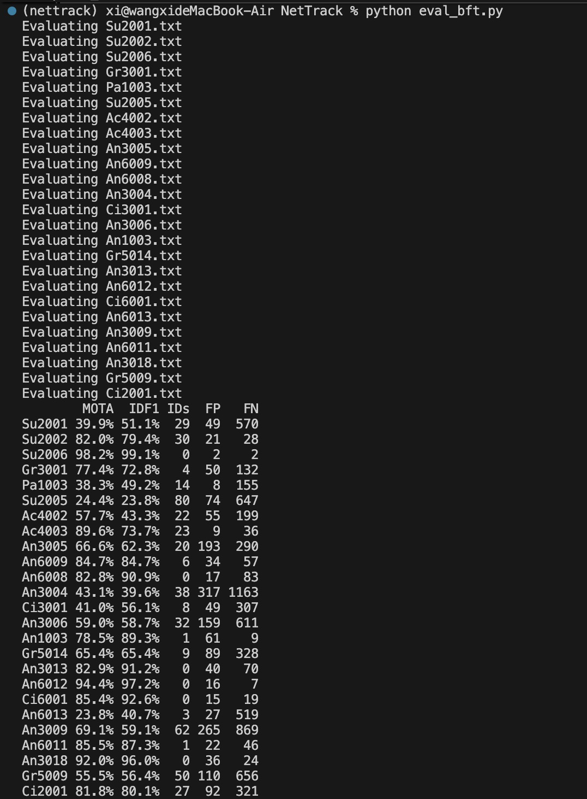
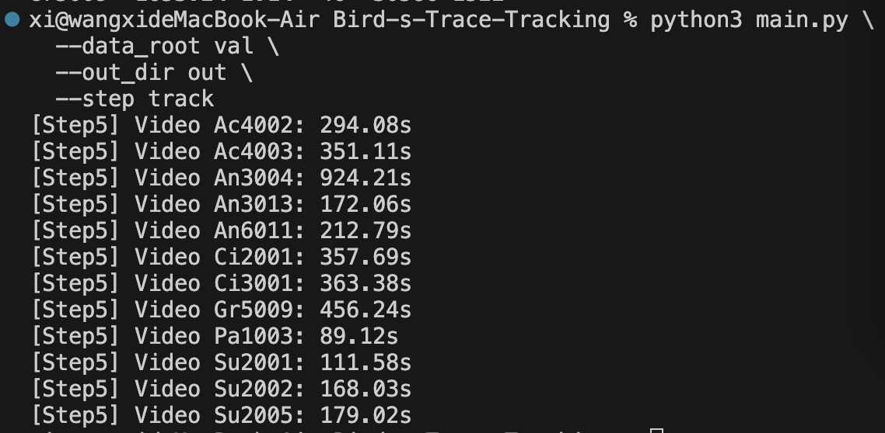

# Bird-s-Trace-Tracking

Due to size limitations, the dataset is not included in this repository.

Here is the link of dataset: https://drive.google.com/file/d/1fwswUfxxmvcd7GQhveXThVYfK0eR0nbw/view?usp=share_link

## Evaluation Results

We compare our classical computer-vision-based tracking pipeline with **NetTrack**, a
state-of-the-art deep learning tracker, on the BFT validation set.

### Quantitative Comparison (NetTrack)

The table above shows the official NetTrack evaluation results reported using standard
MOT metrics (MOTA, IDF1, FP, FN).
NetTrack achieves strong quantitative performance on most sequences, benefiting from
deep object detection and point-level feature tracking.

### Runtime Analysis

The figures above compare the per-video runtime of NetTrack and our proposed classical
CV-based pipeline. (30 hours 41 mins 16 secondes [NetTrack] VS 1 hour 1 min 19 secondes [OurModel])
While NetTrack relies on deep neural network inference and GPU acceleration,
our method runs entirely on CPU using lightweight OpenCV operations.

Overall, our pipeline is **significantly faster** than NetTrack on long sequences,
demonstrating a clear trade-off between tracking accuracy and computational efficiency.
