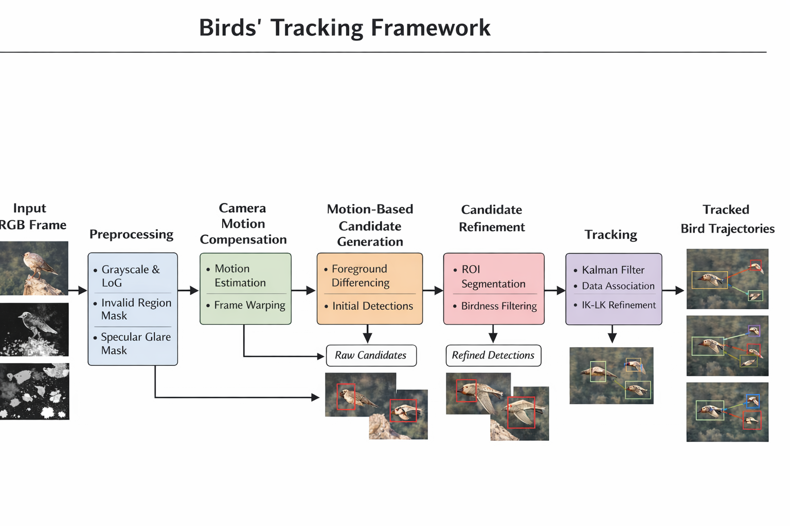
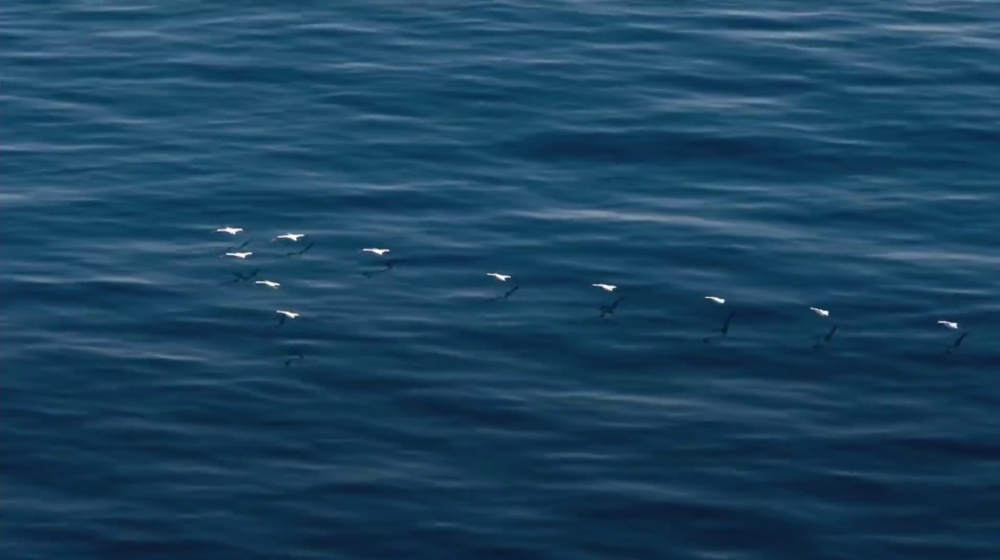
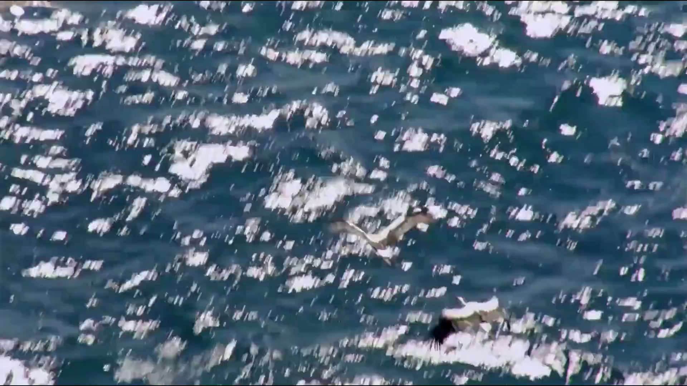
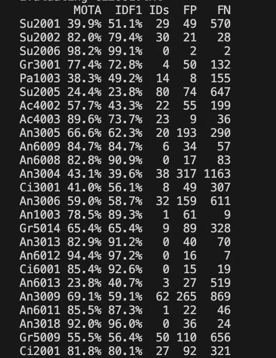
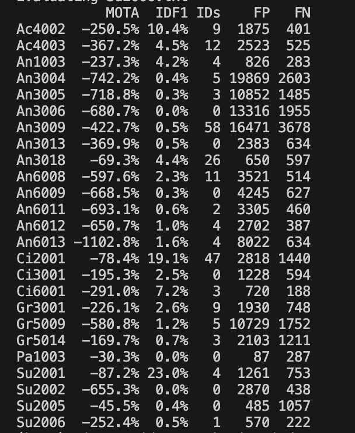
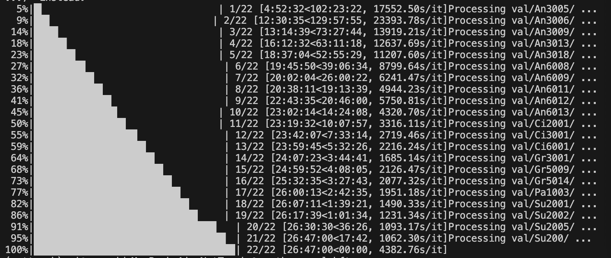
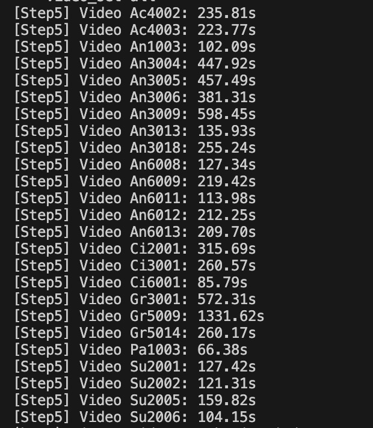

# Birds’ Track: Tracking Objects from dynamic background with OpenCV

## How to use our Bird's Track?
We provide a 5-step pipeline (preprocessing → camera motion comepnsation → candidate generation → candidate refine → tracking and association). You can run any single step using the unified entry script main.py. Here is instruction:
- Download our dataset at [https://drive.google.com/drive/folders/140mPnOVZY - 2apH76at9yYuVGIDWOvsH _ ?usp =share_link](https://drive.google.com/file/d/1fwswUfxxmvcd7GQhveXThVYfK0eR0nbw/view?usp=share_link)(Due to size limitations, the dataset is not included in this repository). Here we use val dataset, you also can change it to train, test.
- Pull our Github URL and install numpy, opencv-python, motmetrics (required only for evaluation) and matplotlib modules.
- Now you can run any step using main.py: all steps share these required arguments:
  * --data_root : dataset root (e.g., ./val)
  * --out_dir : output directory (e.g., ./metric)
  * --step : one of {pre, motion, cand, refine, track}
- You also can choose dataset or other options by these arguments:
  * --video_set : eg (default) or all (eg runs only the built-in example list (e.g., Ac4002, Ci3001, Su2001, ...). 
  * --videos : whatever videos you want, seperated by "," (e.g., "Ac4002,Ci3001,Su2001").
  * --overwrite : overwrite existing saved outputs 
  * --rng_seed : controls random sampling in Step1/2 debug saving
- There are also special options for Step1(1-3) and Step2(4), you can check them in main.py:
  * --subtitle_mask_mode {none,spec_roi} (spec_roi default)
  * --smooth_mode {none,bilateral} (bilateral default)
  * --spec_enable_mode {always,texture_only} (texture_only default)
  * --roi_mode {strips,corners,corners+strips} (strips default)
- Some examples:
  * python3 main.py --data_root ./val --out_dir ./metric --step pre
  * python3 main.py --data_root ./val --out_dir ./metric --step motion --roi_mode corners+strips
  * python3 main.py --data_root ./val --out_dir ./metric --step cand
  * python3 main.py --data_root ./val --out_dir ./metric --step refine -- video_set all
  * python3 main.py --data_root ./val --out_dir ./metric --step track --videos "Ac4002,Ci3001,Su2001"
- After step track, you can evaluate the output by python3 eval_cv.py
  
## Abastract

Tracking fast-moving objects in unconstrained natural videos remains a challenging problem due to background dynamics, illumination changes, camera motion, and scale variation. Classical motion-based pipelines offer efficiency and interpretability, whereas modern deep-learning-based trackers achieve high performance at greater computational cost. This work revisits classical computer vision approaches for multi-object tracking in the context of bird detection and tracking by systematically designing and evaluating an OpenCV-based pipeline against a state-of-the-art deep tracker, NetTrack, on the BFT dataset. 

The proposed pipeline incorporates camera motion compensation, adaptive motion-based detection, region refinement, and Kalman-filter-based data association. Quantitative experiments using MOTA, IDF1,IDs, NP and FP demonstrate that the classical pipeline achieves competitive results in simpler scenarios（e.g., dataset Su2001), while deep-learning-based methods consistently outperform it in highly dynamic and cluttered environments(e.g.,dataset Ci3001).These findings reveal a clear trade-off between tracking
accuracy and computational efficiency.

The dataset is available at [https://drive.google.com/drive/folders/140mPnOVZY - 2apH76at9yYuVGIDWOvsH _ ?usp =share_link](https://drive.google.com/file/d/1fwswUfxxmvcd7GQhveXThVYfK0eR0nbw/view?usp=share_link)(Due to size limitations, the dataset is not included in this repository). You also can find our roadmap and report in the document folder.

## Evaluation Results

We compare our classical computer-vision-based tracking pipeline with **NetTrack**, a
state-of-the-art deep learning tracker, on the BFT validation set.

### Quantitative Comparison 

(NetTrack VS CV-based model)

The table above shows the official NetTrack evaluation results reported using standard
MOT metrics (MOTA, IDF1, FP, FN).
NetTrack achieves strong quantitative performance on most sequences, benefiting from
deep object detection and point-level feature tracking.

Our results can be seen in readme_data folder.

### Runtime Analysis

The figures above compare the per-video runtime of NetTrack and our proposed classical
CV-based pipeline. (30 hours 41 mins [NetTrack] VS 1 hour 51 min [OurModel])
While NetTrack relies on deep neural network inference and GPU acceleration,
our method runs entirely on CPU using lightweight OpenCV operations.

Overall, our pipeline is **significantly faster** than NetTrack on long sequences,
demonstrating a clear trade-off between tracking accuracy and computational efficiency.

## Contribution
Jiren Ren and Xi Wang made the same contribution.
- Jiren Ren: step preprocessing,  step camera motion compensation and step candidate generation.
- Xi Wang: step candidate refinement, step tracking and NetTrack finetune.
